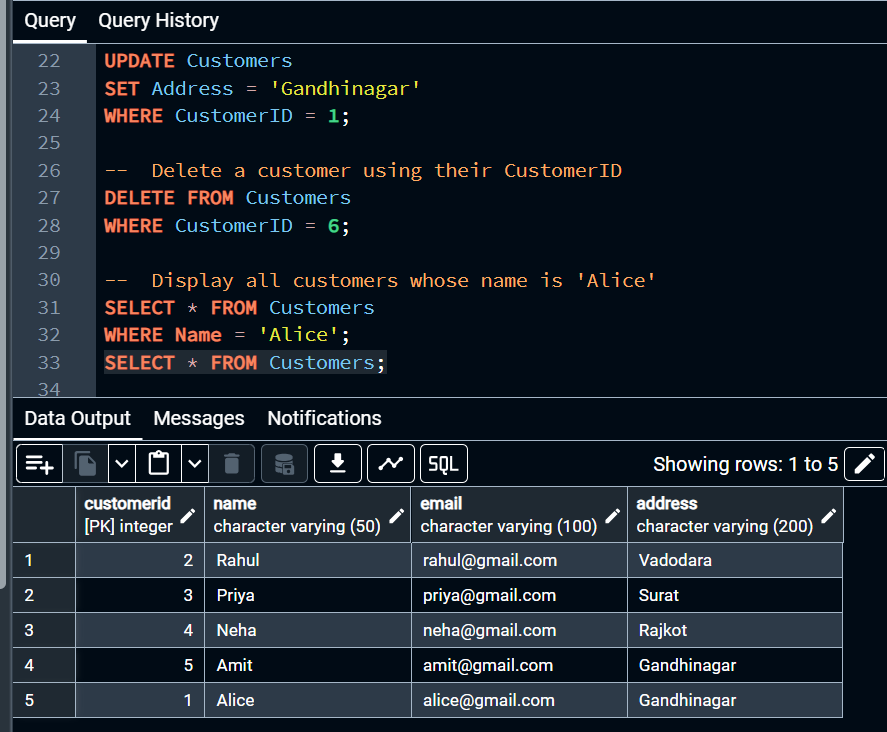
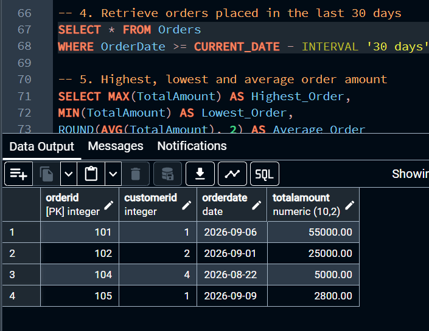
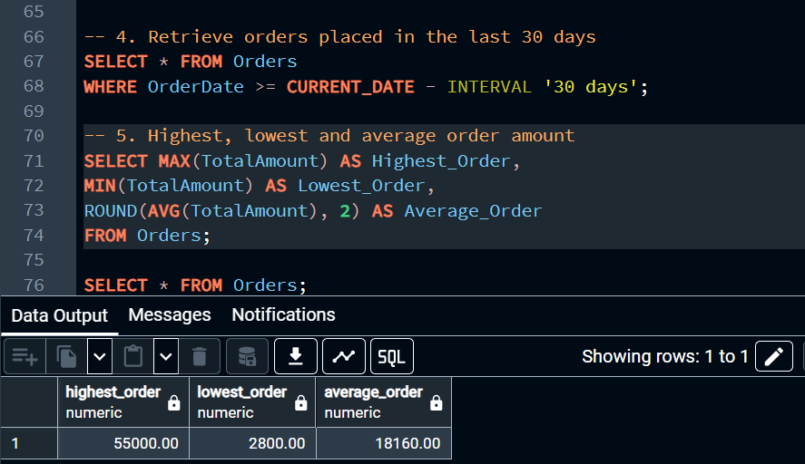
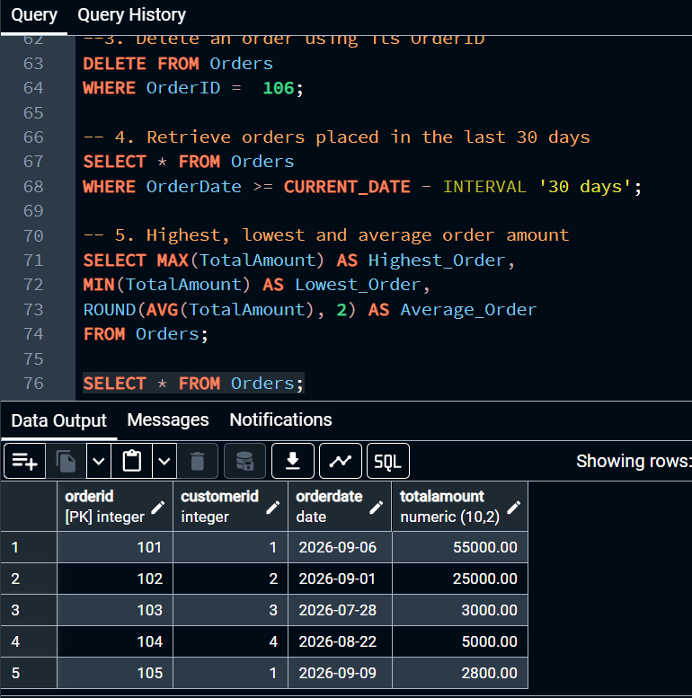
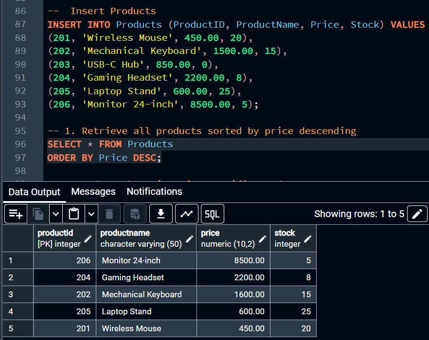
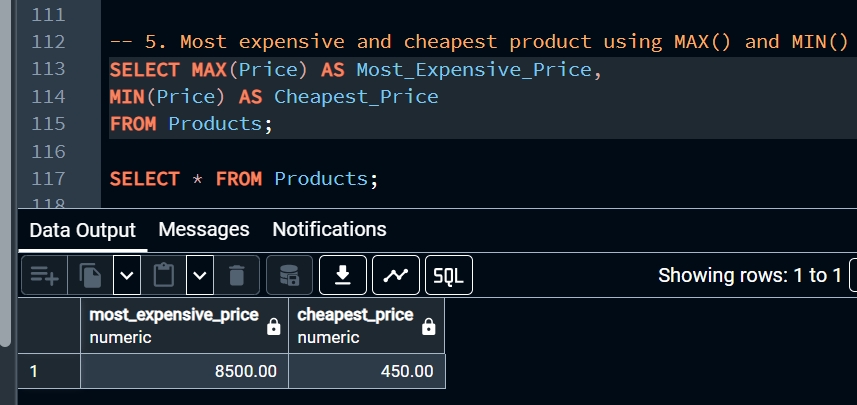
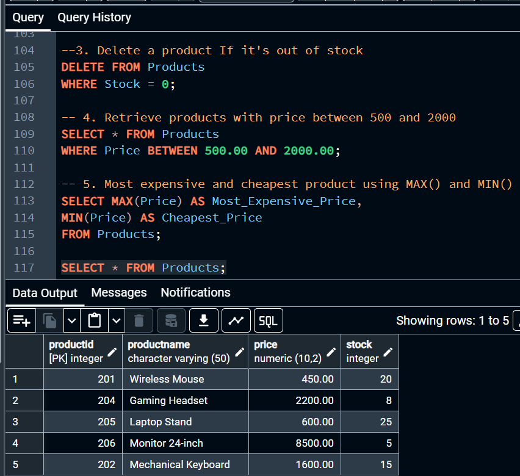
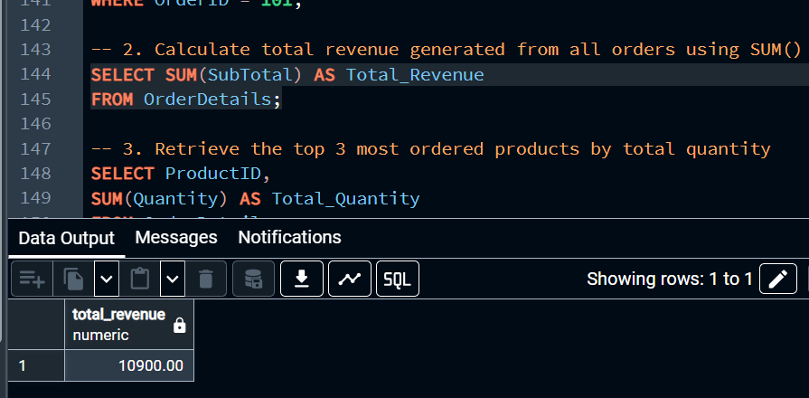
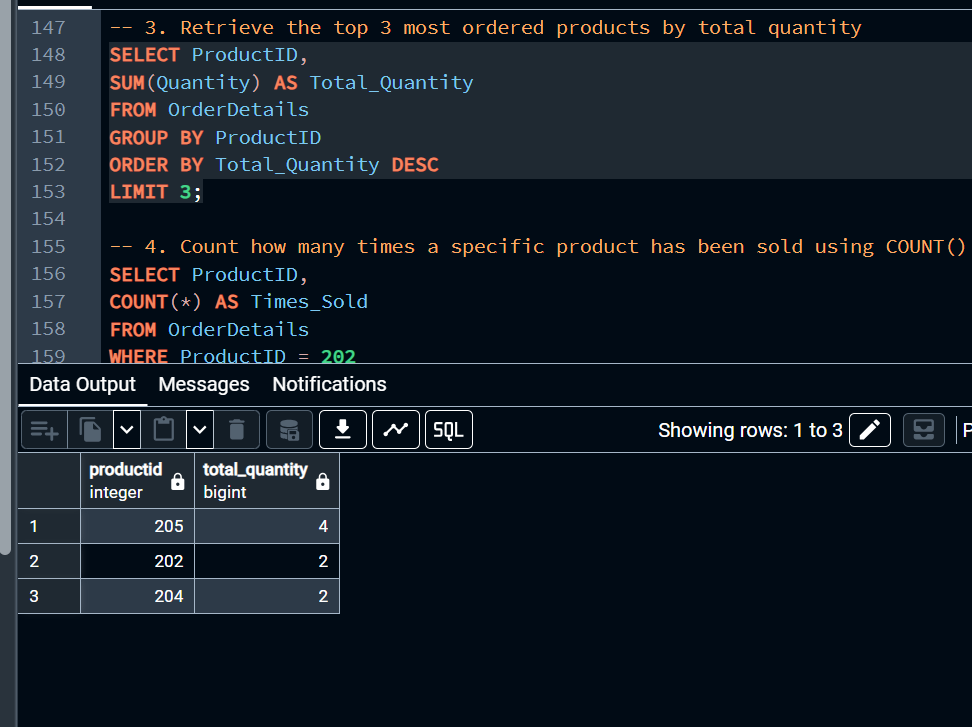
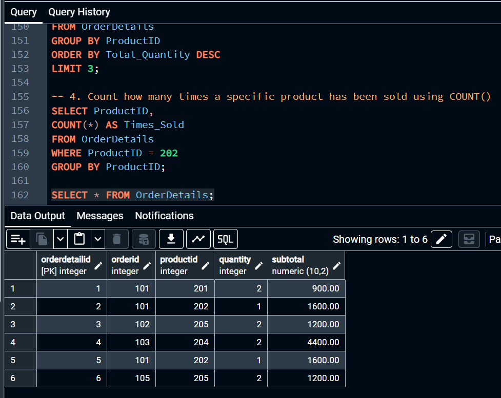

# 📊 Data Digger

Data Digger is a practical SQL project developed using PostgreSQL. The project provides hands-on practice with relational database design, CRUD operations, filtering, sorting, aggregate functions, primary keys, and foreign keys.

---

## 🎯 Project Objective

The main objective of this project is to create and manage an E-Commerce Store database using SQL. The project demonstrates how multiple related tables can be created and connected and how SQL queries can be used to insert, retrieve, update, delete, filter, sort, and summarize data.

---
## 🛠️ Technologies Used

- **Database:** PostgreSQL
- **Tool:** pgAdmin
- **Language:** SQL

---
## 🎥 Video Demonstration

**Video Link:** [https://drive.google.com/file/d/1smTsM8ZWlVbPyTswtI7mNHajI58zAkjr/view?usp=sharing]

---

##  🗄️ Database Schema & Tables

The project consists of four interconnected relational tables:

- **Customers:** CustomerID (PK), Name, Email, Address
- **Orders:** OrderID (PK), CustomerID (FK), OrderDate, TotalAmount
- **Products:** ProductID (PK), ProductName, Price, Stock
- **OrderDetails:** OrderDetailID (PK), OrderID (FK), ProductID (FK), Quantity, SubTotal

**🔗Entity Relationships:**
- `Customers.CustomerID` (1) ───< `Orders.CustomerID` (M)
- `Orders.OrderID` (1) ───< `OrderDetails.OrderID` (M)
- `Products.ProductID` (1) ───< `OrderDetails.ProductID` (M)

---

## 📋 Sample Data Records

### 1. Customers
| CustomerID | Name | Email | Address |
| :--- | :--- | :--- | :--- |
| 1 | Alice | alice@gmail.com | Ahmedabad |
| 2 | Rahul | rahul@gmail.com | Vadodara |
| 3 | Priya | priya@gmail.com | Surat |
| 4 | Neha | neha@gmail.com | Rajkot |
| 5 | Amit | amit@gmail.com | Gandhinagar |
| 6 | Alice | alice6@gmail.com | Jaipur |

### 2. Products
| ProductID | ProductName | Price (₹) | Stock |
| :--- | :--- | :--- | :--- |
| 201 | Wireless Mouse | 450.00 | 20 |
| 202 | Mechanical Keyboard | 1500.00 | 15 |
| 203 | USB-C Hub | 850.00 | 0  |
| 204 | Gaming Headset | 2200.00 | 8 |
| 205 | Laptop Stand | 600.00 | 25 |
| 206 | Monitor 24-inch | 8500.00 | 5 |

### 3. Orders
| OrderID | CustomerID | OrderDate | TotalAmount (₹) |
| :--- | :--- | :--- | :--- |
| 101 | 1 | CURRENT_DATE - 5 | 55,000.00 |
| 102 | 2 | CURRENT_DATE - 10 | 25,000.00 |
| 103 | 3 | CURRENT_DATE - 45 | 3,000.00 |
| 104 | 4 | CURRENT_DATE - 20 | 5,000.00 |
| 105 | 1 | CURRENT_DATE - 2 | 2,700.00 |
| 106 | 5 | CURRENT_DATE - 2 | 2,700.00 |

### 4. OrderDetails
| OrderDetailID | OrderID | ProductID | Quantity | SubTotal (₹) |
| :--- | :--- | :--- | :--- | :--- |
| 1 | 101 | 201 | 2 | 900.00 |
| 2 | 101 | 202 | 1 | 1,600.00 |
| 3 | 102 | 205 | 2 | 1,200.00 |
| 4 | 103 | 204 | 2 | 4,400.00 |
| 5 | 101 | 202 | 1 | 1,600.00 |
| 6 | 105 | 205 | 2 | 1,200.00 |

---

## 📸 Output Screenshots

## 👤 1. Customers Table
  

---

## 🛒  2. Orders Table




---

## 📦 3. Products Table




---

## 📑 4. OrderDetails Table




---

## 💻 SQL Concepts Applied

- **DDL (Data Definition Language):** `CREATE TABLE`, `PRIMARY KEY`, `FOREIGN KEY`
- **DML (Data Manipulation Language):** `INSERT`, `UPDATE`, `DELETE`
- **DQL & Filtering:** `SELECT`, `WHERE`, `ORDER BY`, `BETWEEN`, `LIMIT`
- **Date Arithmetic:** Dynamic 30-day window querying via `CURRENT_DATE - INTERVAL '30 days'`
- **Aggregate Analytics:** `MAX()`, `MIN()`, `AVG()`, `ROUND()`, `SUM()`, `COUNT()`, `GROUP BY`

---

## ▶️ How to Run

1. Open **PostgreSQL** in **pgAdmin** or Query Tool.
2. Open and run the complete `data_digger.sql` file.
3. Check the individual verification queries to view updated data.

---

## 📁 Project Structure

```text
PR1-Data-Digger/
│
├── data_digger.sql
└── README.md
```
---

## 📊 Data Analysis Performed

* Analyzed customer records and customer-based orders.
* Retrieved orders placed within the last 30 days.
* Calculated highest, lowest, and average order amounts.
* Analyzed products based on price and stock.
* Calculated total revenue from order details.
* Identified the top 3 products by quantity ordered.
* Counted product sales using `COUNT()`.

---

## 🧠 Key Learnings

* Created and managed relational tables using PostgreSQL.
* Used Primary Keys and Foreign Keys to connect tables.
* Performed CRUD operations using `INSERT`, `UPDATE`, and `DELETE`.
* Retrieved and filtered data using `SELECT`, `WHERE`, `BETWEEN`, and `ORDER BY`.
* Used aggregate functions such as `MAX()`, `MIN()`, `AVG()`, `SUM()`, and `COUNT()`.
* Used `GROUP BY`, `LIMIT`, and PostgreSQL date calculations for data analysis.

## 🏁 Conclusion

* Data Digger provides practical experience in working with a relational E-Commerce database using PostgreSQL.
* The project demonstrates database design, table relationships, CRUD operations, data filtering, sorting, date calculations, and aggregate analysis using SQL.
* It is a beginner-friendly project that builds a strong foundation in PostgreSQL and relational database concepts.
