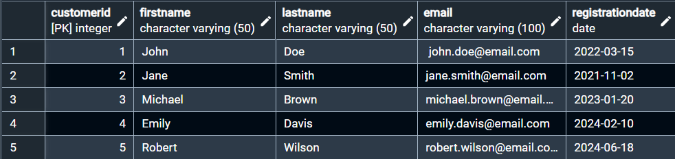
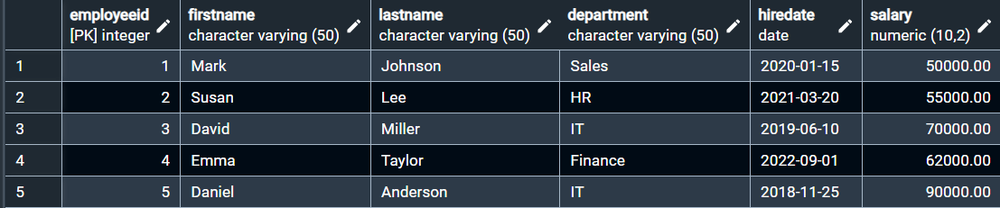
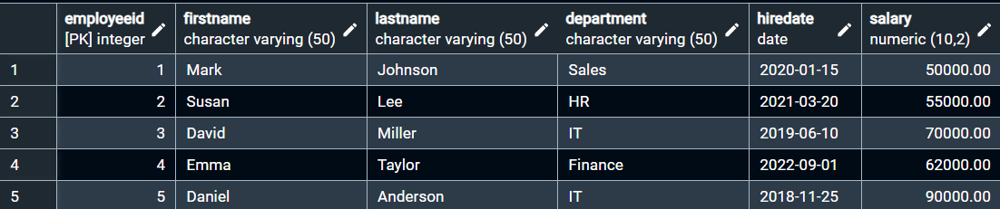
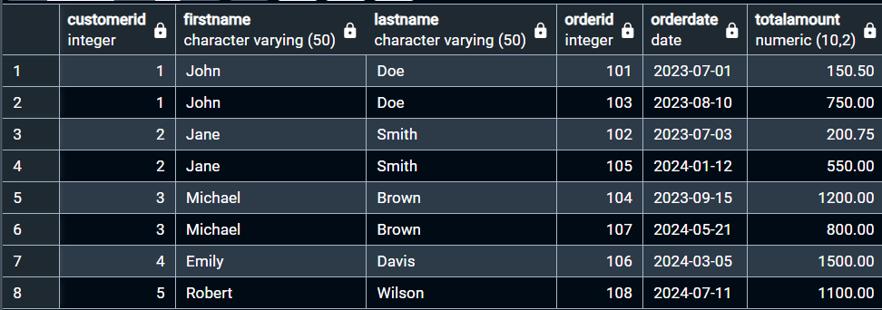
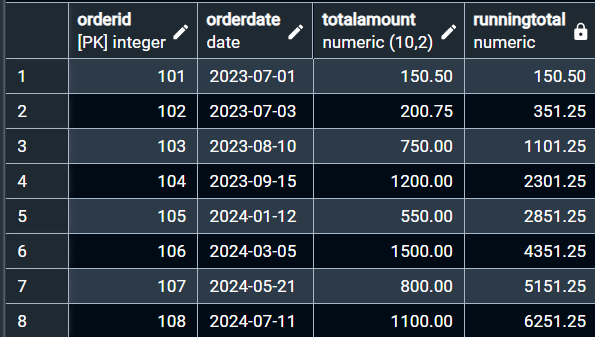
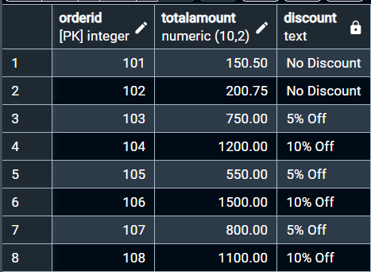

# 📊 PR 2 – Data Transformation & SQL Analysis

## 📌 Project Overview

**Data Transformer** is a PostgreSQL-based SQL project created to practice data transformation, analysis, and advanced SQL operations using relational business data.

The project uses three main tables:

- **Customers** – customer registration and contact information
- **Orders** – customer orders, order dates, and transaction amounts
- **Employees** – employee department, hiring date, and salary information

The project demonstrates how relational data can be joined, transformed, cleaned, analyzed, and categorized using PostgreSQL.

---

## 🎥 Video Demonstration

[Watch Video Demonstration](https://drive.google.com/file/d/1B1sXWGQK2nLEl6EpFB4YWKVgQHAirhlZ/view?usp=sharing)


---

## 🎯 Objective

The main objective of this project is to develop practical SQL skills required for:

- Data reporting and relational data analysis
- Data transformation and cleaning
- Date and string manipulation
- Analytical calculations
- Business-rule implementation

---

## 🛠️ Technologies Used

| Technology | Purpose |
|---|---|
| PostgreSQL | Database and SQL operations |
| pgAdmin 4 | Query execution and result verification |
| SQL | Data creation, transformation, and analysis |
| GitHub | Project submission and version control |

---

## 🗃️ Database Design

### 1. Customers Table

| Column | Data Type | Constraint |
|---|---|---|
| CustomerID | INT | Primary Key |
| FirstName | VARCHAR(50) | NOT NULL |
| LastName | VARCHAR(50) | NOT NULL |
| Email | VARCHAR(100) | NOT NULL |
| RegistrationDate | DATE | NOT NULL |

### 2. Orders Table

| Column | Data Type | Constraint |
|---|---|---|
| OrderID | INT | Primary Key |
| CustomerID | INT | Foreign Key |
| OrderDate | DATE | NOT NULL |
| TotalAmount | DECIMAL(10,2) | NOT NULL |

**Relationship:** `Orders.CustomerID → Customers.CustomerID`

### 3. Employees Table

| Column | Data Type | Constraint |
|---|---|---|
| EmployeeID | INT | Primary Key |
| FirstName | VARCHAR(50) | NOT NULL |
| LastName | VARCHAR(50) | NOT NULL |
| Department | VARCHAR(50) | NOT NULL |
| HireDate | DATE | NOT NULL |
| Salary | DECIMAL(10,2) | NOT NULL |

---

## 📸 Database & Selected Query Results

The following screenshots show the database tables and selected outputs from important SQL operations.

### Customers Table



### Orders Table



### Employees Table



### FULL OUTER JOIN



### Running Total using Window Function



### Discount Classification using CASE



---

## 🔍 SQL Work Performed

### 🔗 JOIN Operations

- **INNER JOIN** – retrieves matching customer and order records.
- **LEFT JOIN** – retrieves all customers and their matching orders.
- **RIGHT JOIN** – retrieves all orders and their corresponding customers.
- **FULL OUTER JOIN** – retrieves all customers and all orders, including unmatched records.

### 🔎 Subqueries

- Find customers who placed orders above the average order amount.
- Find employees whose salary is above the average salary.

### 📅 Date Operations

- Extract year from `OrderDate`
- Extract month from `OrderDate`
- Calculate the difference between `OrderDate` and the current date
- Format dates into `DD-Mon-YYYY`

Functions used: `EXTRACT()` · `CURRENT_DATE` · `TO_CHAR()`

### 🔤 String Operations

- `CONCAT()` to create a full name
- `REPLACE()` to replace part of a string
- `UPPER()` to convert text to uppercase
- `LOWER()` to convert text to lowercase
- `TRIM()` to remove extra spaces from email data

### 📊 Window Functions

- `SUM() OVER()` for a running total of order amounts
- `RANK() OVER()` for ranking orders by `TotalAmount`

### 🧠 CASE Expressions

Business rules are implemented using `CASE`, `WHEN`, `THEN`, `ELSE`, and `END`.

**Order Discount**

| Condition | Discount |
|---|---|
| TotalAmount > 1000 | 10% Off |
| TotalAmount > 500 | 5% Off |
| TotalAmount <= 500 | No Discount |

**Employee Salary Category**

| Salary | Category |
|---|---|
| >= 60000 | High |
| >= 50000 | Medium |
| < 50000 | Low |

> **Assumption:** The salary category limits were selected because the assignment does not specify exact thresholds.

---

## 📚 SQL Concepts Practiced

| Area | Concepts |
|---|---|
| Joins | INNER, LEFT, RIGHT, FULL OUTER |
| Subqueries | AVG with nested SELECT |
| Date Functions | EXTRACT, CURRENT_DATE, TO_CHAR |
| String Functions | CONCAT, REPLACE, UPPER, LOWER, TRIM |
| Window Functions | SUM() OVER(), RANK() OVER() |
| Conditional Logic | CASE, WHEN, THEN, ELSE, END |
| Database Design | Primary Key, Foreign Key, Constraints |
| Data Analysis | Running total, ranking, average comparison |

---

## ▶️ How to Run

1. Open **pgAdmin 4**.
2. Create or select a PostgreSQL database.
3. Open **Query Tool**.
4. Open `Data_Transformer.sql`.
5. Run the complete SQL script.
6. Verify the three tables using:

```sql
SELECT * FROM customers;
SELECT * FROM orders;
SELECT * FROM employees;
```

7. Execute the required queries individually to verify their results.

---

## 📁 Project Structure

```text
PR2-Data-Transformer/
│
├── Data_Transformer.sql
├── README.md
│
└── screenshots/
    ├── customer-Table.png
    ├── order-Table.png
    ├── employee_table.png
    ├── full_outer_join.png
    ├── running_total.png
    └── discount_case.png
```

---

## 💼 Practical Use Cases

- Customer and order reporting
- Identifying high-value orders
- Comparing employee salaries
- Cleaning customer contact information
- Date-based reporting
- Cumulative sales analysis
- Transaction ranking
- Applying discounts using business rules
- Employee salary classification

---

## 🎓 Key Learning Outcomes

Through this project, I practiced:

- Designing relational tables using **Primary Key and Foreign Key constraints**
- Working with multiple types of **SQL JOINs**
- Using **subqueries** for comparative analysis
- Performing **date and string transformations**
- Cleaning text data using SQL functions
- Applying **window functions** for analytical calculations
- Implementing business rules using **CASE expressions**
- Organizing SQL queries into a structured project

---

## 📌 Conclusion

The **Data Transformer** project provides practical experience with PostgreSQL and SQL techniques used in data analysis and reporting.

It demonstrates the complete process of working with relational data — from database design and data cleaning to transformation, analytical calculations, and business-rule implementation.
