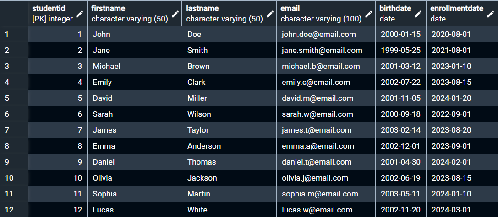
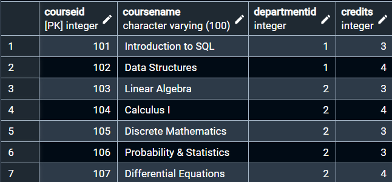
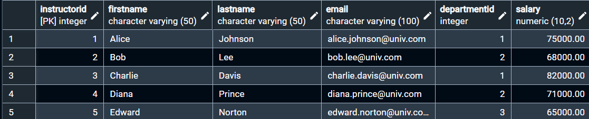
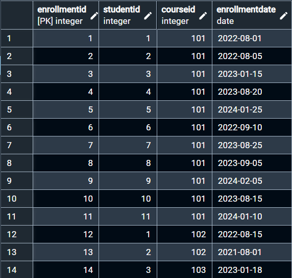
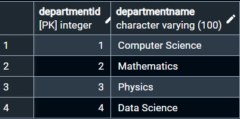
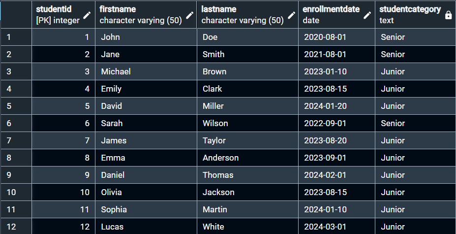
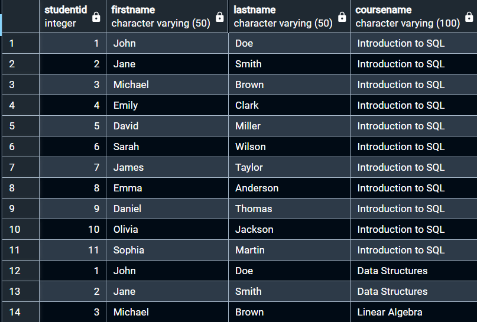
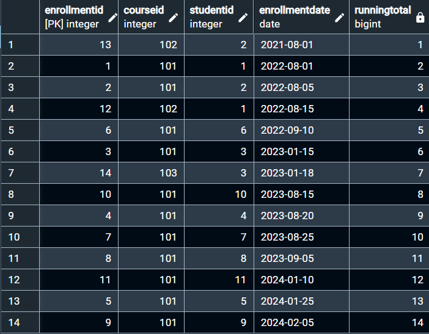

# 🎓 University Course Management System – SQL Final Project


## 🎥 Video Demonstration

Watch Video Demonstration: [https://drive.google.com/file/d/1ODINM8kiOJ1e3Yv5xaQlilU2hwP0AhPS/view?usp=sharing]

---

## 📌 Project Overview

**University Course Management System** is a PostgreSQL-based SQL project designed to manage university data related to students, courses, instructors, enrollments, and departments.

The project demonstrates relational database design, CRUD operations, data filtering, joins, aggregation, subqueries, and advanced SQL concepts.

---

## 🎯 Objective

The main objectives of this project are to:

* Design a relational university database.
* Create and connect five related tables.
* Perform CRUD operations.
* Retrieve and analyze data using SQL queries.
* Apply joins, aggregation, subqueries, and SQL functions.
* Implement conditional logic and running totals.

---

## 🛠️ Technologies Used

| Technology | Purpose                                     |
| ---------- | ------------------------------------------- |
| PostgreSQL | Database and SQL operations                 |
| pgAdmin 4  | Query execution and result verification     |
| SQL        | Data creation, analysis, and transformation |
| GitHub     | Project submission and version control      |

---

## 🗃️ Database Design

### 1. Students Table

| Column         | Data Type    | Constraint       |
| -------------- | ------------ | ---------------- |
| StudentID      | INT          | Primary Key      |
| FirstName      | VARCHAR(50)  | NOT NULL         |
| LastName       | VARCHAR(50)  | NOT NULL         |
| Email          | VARCHAR(100) | UNIQUE, NOT NULL |
| BirthDate      | DATE         | NOT NULL         |
| EnrollmentDate | DATE         | NOT NULL         |

### 2. Courses Table

| Column       | Data Type    | Constraint  |
| ------------ | ------------ | ----------- |
| CourseID     | INT          | Primary Key |
| CourseName   | VARCHAR(100) | NOT NULL    |
| DepartmentID | INT          | Foreign Key |
| Credits      | INT          | NOT NULL    |

### 3. Instructors Table

| Column       | Data Type     | Constraint              |
| ------------ | ------------- | ----------------------- |
| InstructorID | INT           | Primary Key             |
| FirstName    | VARCHAR(50)   | NOT NULL                |
| LastName     | VARCHAR(50)   | NOT NULL                |
| Email        | VARCHAR(100)  | UNIQUE, NOT NULL        |
| DepartmentID | INT           | Foreign Key             |
| Salary       | NUMERIC(10,2) | Added using ALTER TABLE |

### 4. Enrollments Table

| Column         | Data Type | Constraint  |
| -------------- | --------- | ----------- |
| EnrollmentID   | INT       | Primary Key |
| StudentID      | INT       | Foreign Key |
| CourseID       | INT       | Foreign Key |
| EnrollmentDate | DATE      | NOT NULL    |

### 5. Departments Table

| Column         | Data Type    | Constraint  |
| -------------- | ------------ | ----------- |
| DepartmentID   | INT          | Primary Key |
| DepartmentName | VARCHAR(100) | NOT NULL    |

---

## 🔗 Database Relationships

```text
                    Departments
                    /          \
                   /            \
                  ▼              ▼
           Instructors         Courses
                                  │
                                  ▼
                            Enrollments
                              ▲
                              │
                           Students
```

### Relationships

* **Departments → Instructors:** One-to-Many
* **Departments → Courses:** One-to-Many
* **Students → Enrollments:** One-to-Many
* **Courses → Enrollments:** One-to-Many
* **Students ↔ Courses:** Many-to-Many through **Enrollments**

### Foreign Key Connections

```text
Instructors.DepartmentID → Departments.DepartmentID
Courses.DepartmentID     → Departments.DepartmentID
Enrollments.StudentID    → Students.StudentID
Enrollments.CourseID     → Courses.CourseID
```

---

## 📸 Selected Query Results

### Students Table



### Courses Table



### Instructors Table



### Enrollments Table



### Departments Table



### Student Classification



### Students and Their Courses



### Running Total



---

## 🔍 SQL Work Performed

The project covers the following SQL concepts:

* CRUD operations on all five tables
* Data filtering using `WHERE` and `LIMIT`
* Grouping using `GROUP BY`
* Filtering grouped data using `HAVING`
* Aggregate functions such as `COUNT()`, `AVG()`, and `MAX()`
* `INNER JOIN` and `LEFT JOIN`
* Subqueries
* `ALTER TABLE` to add the Salary column
* `EXTRACT()` for working with enrollment years
* `CONCAT()` for creating instructor full names
* Window functions for running totals
* `CASE` expression for conditional classification

---

## 📊 Calculations

The project includes SQL-based calculations and data analysis using aggregate and window functions.

Examples of calculations performed include:

* Counting students enrolled in each course
* Counting records using `COUNT()`
* Finding maximum values using `MAX()`
* Generating running totals using a window function
* Classifying records using `CASE`

These calculations demonstrate how SQL can be used to analyze and summarize university data.

---

## 📚 Key Learning

Through this project, I learned:

* Relational database and table design
* Primary Key and Foreign Key relationships
* CRUD operations
* Data filtering and aggregation
* `INNER JOIN` and `LEFT JOIN`
* Subqueries
* Date and string functions
* Window functions and running totals
* `CASE` expressions and conditional logic

---

## 📁 Project Structure

```text
University-Course-Management-SQL/
│
├── README.md
├── university_course_management.sql
│
└── screenshots/
    ├── student_tables.png
    ├── course_tables.png
    ├── instructor_tables.png
    ├── enrollment_tables.png
    ├── department_tables.png
    ├── student_classification.png
    ├── student_course_inner_join.png
    └── running_total.png
```

---

## 🎓 Conclusion

The **University Course Management System** demonstrates practical SQL skills by combining relational database design, CRUD operations, data filtering, aggregation, joins, subqueries, and advanced SQL functions in PostgreSQL.

This project provides practical experience in designing and analyzing a relational database using **PostgreSQL and pgAdmin 4**.
