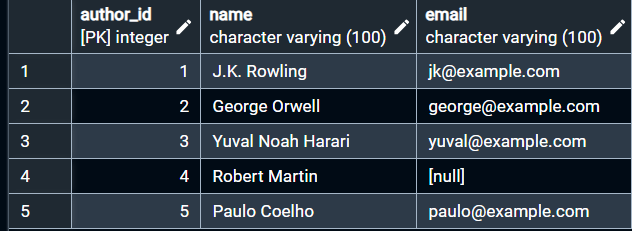
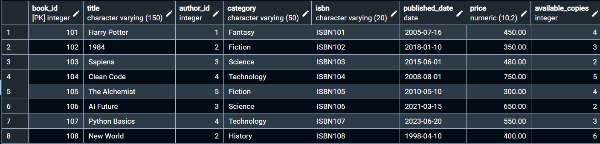
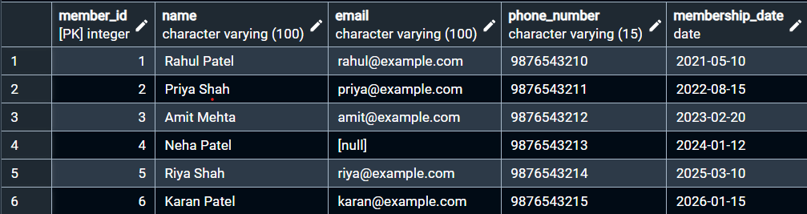
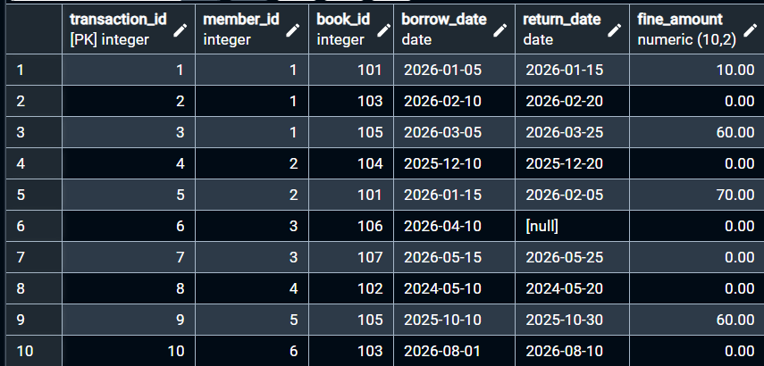
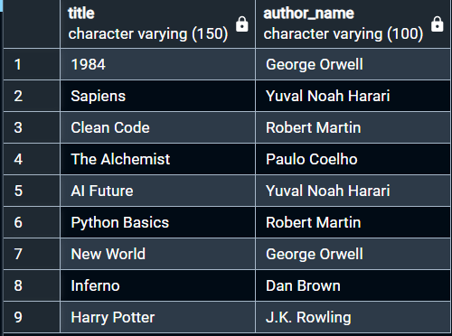
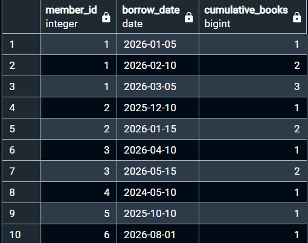
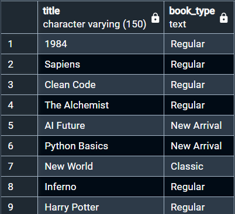

# 📚 Smart Library Management System

## 🎥 Video Demonstration

Watch Video Demonstration: [https://drive.google.com/file/d/1bbr2Cburd2yn6NJdgpmH22PSy1DXLIAT/view?usp=sharing]

---
## 📌 Project Overview

**Smart Library Management System** is a PostgreSQL-based database project developed to manage books, authors, members, and library transactions.

The project demonstrates practical SQL concepts used in a real-world library database, including table relationships, CRUD operations, filtering, grouping, joins, subqueries, aggregate functions, date and string functions, window functions, and CASE expressions.

---

## 🎯 Objectives

- Manage books and authors
- Manage library members
- Track book borrowing and returning
- Calculate and analyze late return fines
- Analyze library data using SQL queries
- Understand relationships between multiple tables

---

## 💻 Technology Used

- **Database:** PostgreSQL
- **Tool:** pgAdmin 4
- **Language:** SQL

---

## 🗃️ Table Structure

### 1. Authors Table

| Column Name | Data Type | Constraint |
|---|---|---|
| `author_id` | INT | PRIMARY KEY |
| `name` | VARCHAR(100) | NOT NULL |
| `email` | VARCHAR(100) | — |

### 2. Books Table

| Column Name | Data Type | Constraint |
|---|---|---|
| `book_id` | INT | PRIMARY KEY |
| `title` | VARCHAR(150) | NOT NULL |
| `author_id` | INT | FOREIGN KEY |
| `category` | VARCHAR(50) | — |
| `isbn` | VARCHAR(20) | — |
| `published_date` | DATE | — |
| `price` | DECIMAL(10,2) | — |
| `available_copies` | INT | — |

### 3. Members Table

| Column Name | Data Type | Constraint |
|---|---|---|
| `member_id` | INT | PRIMARY KEY |
| `name` | VARCHAR(100) | NOT NULL |
| `email` | VARCHAR(100) | — |
| `phone_number` | VARCHAR(15) | — |
| `membership_date` | DATE | — |

### 4. Transactions Table

| Column Name | Data Type | Constraint |
|---|---|---|
| `transaction_id` | INT | PRIMARY KEY |
| `member_id` | INT | FOREIGN KEY |
| `book_id` | INT | FOREIGN KEY |
| `borrow_date` | DATE | — |
| `return_date` | DATE | — |
| `fine_amount` | DECIMAL(10,2) | — |

---

## 🗂️ Database Schema

The project contains four main tables:

| Table | Purpose |
|---|---|
| `Authors` | Stores author details |
| `Books` | Stores book information and availability |
| `Members` | Stores library member details |
| `Transactions` | Stores borrowing and returning records |

### 🔗 Table Relationships

- `Authors` → `Books` (One-to-Many: One author can write multiple books)
- `Members` → `Transactions` (One-to-Many: One member can have multiple transactions)
- `Books` → `Transactions` (One-to-Many: One book can be borrowed multiple times)

Primary keys (`PRIMARY KEY`) and foreign keys (`FOREIGN KEY`) maintain referential integrity across all tables.

---

## 📊 Project Screenshots

The project includes **7 selected screenshots** showing the main table data and key SQL outputs.

### 📁 Table Data

- **Authors Table**  
  

- **Books Table**  
  

- **Members Table**  
  

- **Transactions Table**  
  

- **JOIN Output**  
  

- **Aggregate & Subquery Output**  
  

- **Window Function & CASE Output**  
  

---

## 🛠️ SQL Concepts Covered

| SQL Concept | Purpose |
|---|---|
| `CREATE TABLE` | Creates tables and defines column datatypes |
| `PRIMARY KEY` | Uniquely identifies each record |
| `FOREIGN KEY` | Connects related tables and enforces constraints |
| `INSERT` | Adds new records into tables |
| `UPDATE` | Modifies existing records |
| `DELETE` | Removes records based on conditions |
| `SELECT` | Retrieves data from one or more tables |
| `WHERE` | Filters rows based on specific conditions |
| `GROUP BY` | Groups rows for aggregate calculations |
| `HAVING` | Filters grouped results |
| `ORDER BY` | Sorts output in ascending or descending order |
| `LIMIT` | Restricts the number of returned rows |
| `JOIN` | Combines data from related tables (INNER, LEFT, RIGHT) |
| `Subqueries` | Executes nested queries inside an outer query |
| `Aggregate Functions` | Performs calculations (`COUNT`, `SUM`, `AVG`, `MIN`, `MAX`) |
| `Date Functions` | Handles date arithmetic, intervals, and late fee logic |
| `String Functions` | Formats and transforms text values |
| `Window Functions` | Performs ranking and analytical calculations |
| `CASE` | Implements conditional `IF-THEN-ELSE` logic |

---

## 📁 Project Structure

```text
Smart-Library-Management-System/
│
├── library_management.sql
├── README.md
│
└── screenshots/
    ├── 01_authors_table.png
    ├── 02_books_table.png
    ├── 03_members_table.png
    ├── 04_transactions_table.png
    ├── 05_join_output.png
    ├── 06_aggregate_output.png
    └── 07_window_case_output.png
```

---

## ▶️ How to Run

1. Open **pgAdmin 4**.
2. Connect to your active PostgreSQL server.
3. Create a new database named `library_db` (or your preferred name).
4. Open the **Query Tool** on that database.
5. Open the `library_management.sql` file.
6. Execute the SQL script (Press `F5` or click **Execute**).
7. Run the provided verification queries to inspect the data in the output panel.

---

## 🎓 Key Learnings

Through this project, practical skills developed include:

- Designing a normalized relational database schema
- Implementing primary and foreign key constraints
- Writing efficient queries using multi-table `JOIN` statements
- Performing data aggregation and multi-level grouping
- Implementing analytical workflows with window functions
- Managing temporal data and business logic with PostgreSQL date functions

---

## ⭐ Project Highlights

- Designed a relational database using four interconnected tables
- Implemented primary key and foreign key relationships
- Performed CRUD operations on library data
- Used different JOINs to retrieve related information
- Applied aggregate functions for data analysis
- Used subqueries for advanced data retrieval
- Implemented date and string operations
- Applied window functions and CASE expressions
- Used PostgreSQL with pgAdmin 4 for database development

---

## ✅ Conclusion

The Smart Library Management System is a practical PostgreSQL project that demonstrates database design, relational table management, CRUD operations, data analysis, and advanced SQL querying techniques.

It provides hands-on experience with PostgreSQL and demonstrates how SQL can be used to manage and analyze structured library data.

---
